

# Introduction
- Llama 3.1 405B trained over 16k GPUs for 30M H100 hours.
- Using AWS H100 pricing **$212M**.
- A 1.2x increase in training speed would have saved **$36M** in cloud costs.
- WLLM is a work from Meta and UCSD, released ~6 months after their training Llama 3 that achieves this.

---

# Background - Model Architecture
Things to keep in mind:
- Really big models, 405B = 910GB with 126 transformer blocks.
- Self-Attention, a layer that enriches tokens in a sequence with other token information.
- Feed-Forward, a linear matrix multiplication layer.

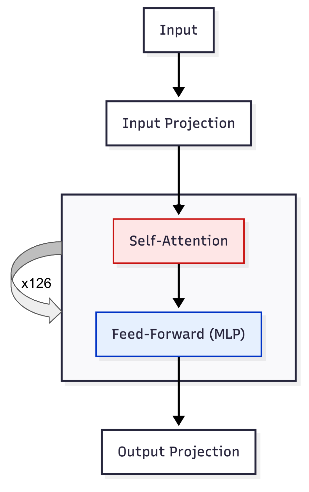

---
# Self Attention
- Attention scales quadratically with the number of past tokens $O(T^2)$
- Not all tokens are equal: Processing later tokens in a document require more computation than earlier.
- When packing multiple documents for training, control attention span using masks.
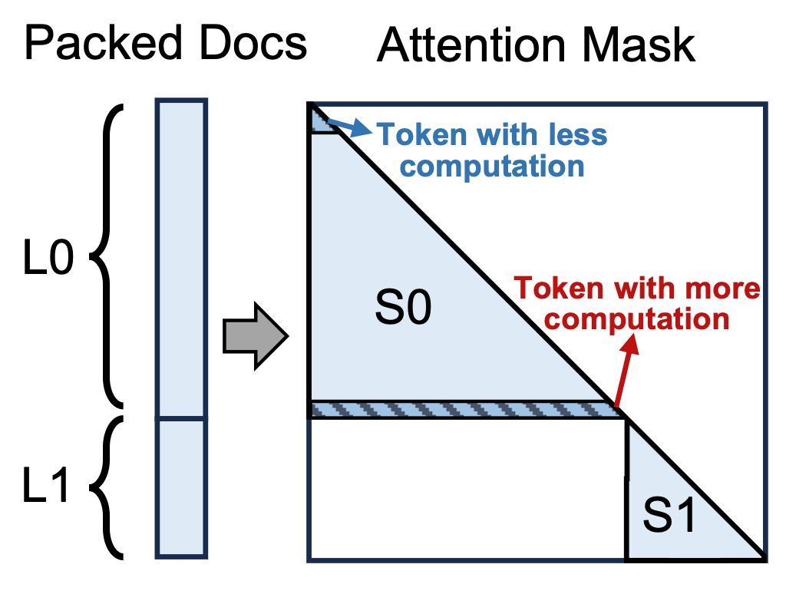

---
# 4D Parallelism
- Huge models are trained on huge clusters because of scale and necessity.
- Tensor shape $[B, T, H]$ across several layers.
- 4D Parallelism splits this shape in various ways.
    - Data - Split $B$ across replicated model.
    - Pipeline - Split model into groups of layers.
    - Context - Split along sequence length $T$
    - Tensor - Split across the $H$.

---
# 4D Parallelism

  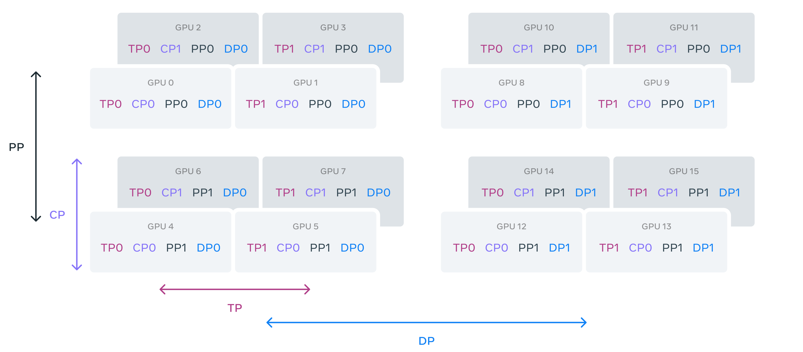

$$
DP > PP > CP > TP
$$
---
# Motivation #1 - Pipeline Imbalance
- Pipeline Parallelism splits $B$ into $N$ $\mu$B to hide delays.
- Balanced Batches $\rightarrow$ Higher throughput

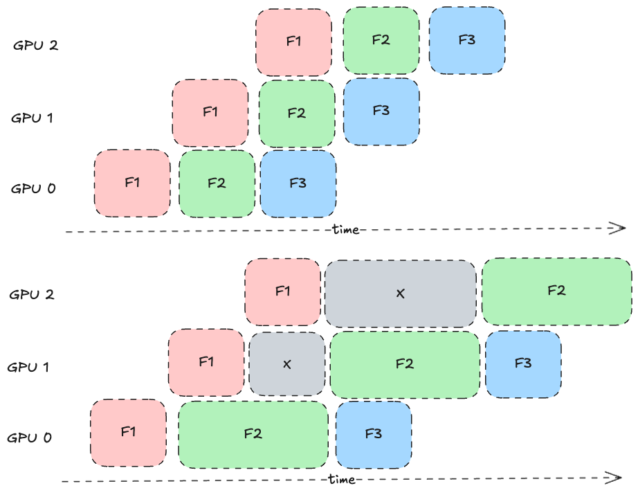

---

# Motivation #1 - Pipeline Imbalance
- Naive approach $\rightarrow$ split by tokens.
- Each $\mu$B has uniform sequence length = $\texttt{CONTEXT\_WINDOW\_SIZE}$
- Does this lead to equal attention?
- $k.128^2 >> k.128 * 1^2$

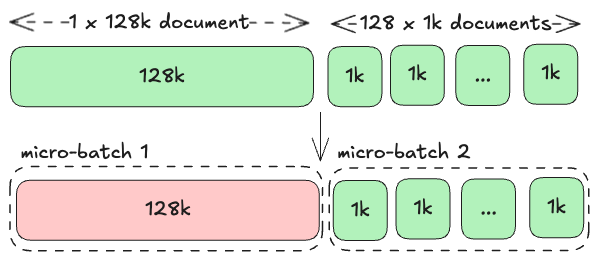

---
# Motivation #2 - Context Imbalance
- Workload across CP workers should be balanced.
- After packing, split the sequence into $2.CP$ parts and assign one from front and one from back to balance attention.
- Good heuristic, fails for multiple packed documents. Common in long context training.
- Not a huge problem, but every millisecond adds up!
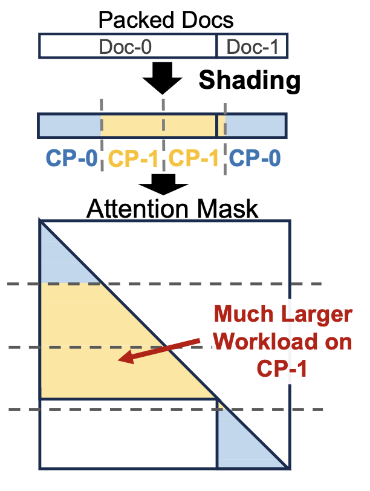

---
  - show figure 3
      - 3a motivates that there is a lot of variance in the input document size. long inputs can cause workload imbalance.
      - 3b motivates that absolute token position is actually a bad proxy for computation intensity.
          - perhaps a better metric might have been average in-document prefix length, since that is the one that matters.
          - look at their presentation, if available to see how they argue.
---
# Baseline: Attention-Aware packing.
**Idea**: Divide $B$ into $\mu$B by estimating $d_i^2$ as attention cost for each document.

- It works, but limited balancing improvemnts $\rightarrow$ limited speedup.
- Higher balancing across $\mu$B requires balancing across multiple global $B$. This disturbs the random order of training and loss convergence.
- It might be impossible to come up with such a $\mu$B construction, if there are no candidates.

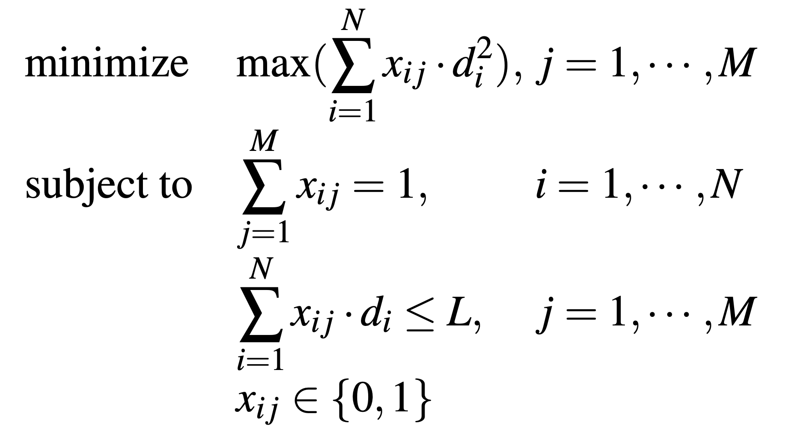

---

# Variable-Length Packing
**Idea**: Allow $len(\mu B) > \texttt{CONTEXT\_SIZE}$ for weaker $\mu B$

- Attention is Quadratic, but other operations are linear (feed-forward, comms etc.)
- Balance the total workload, not just attention.
- Balance long documents against many shorter documents.

$\min \left( \max \left( \sum_{i=1}^{N} \big( W_a(x_{ij} \cdot d_i) + W_l(x_{ij} \cdot d_i) \big) \right) \right)$

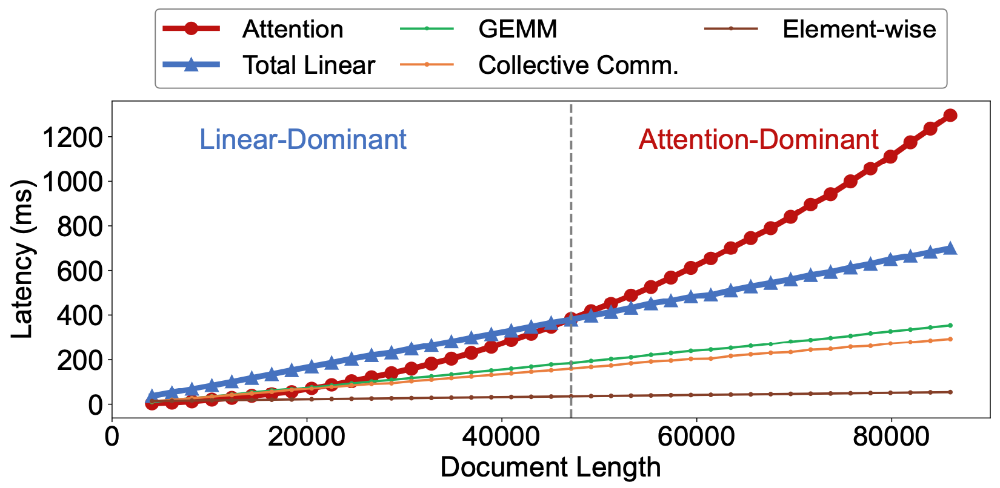

---

<!-- _class: outlier-slide -->
# Outlier document detection
- Still, you might not have sufficient smaller documents to balance the load of a long document.
- Observe: there aren't that many ultra-long documents.
- Instead of balancing across multiple batches, delay the few long documents.
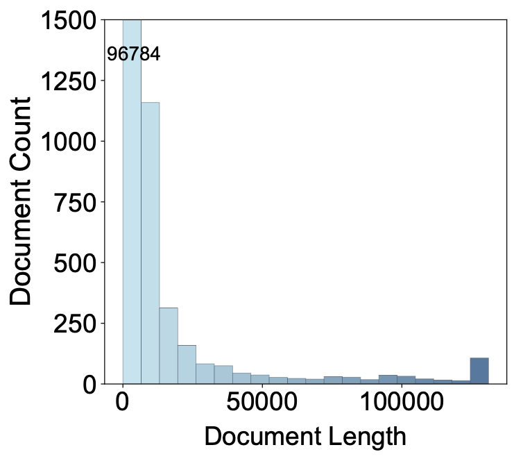
<!-- - Key observation: such long documents are not that frequent. Let's delay them.
    - Suppose you are trying to form N micro-batches on every iteration.
    - Use a single queue, that holds documents that are greater than a threshold L1. (outlier)
    - When you get a global batch, any outlier documents (length > L1) are moved into this queue.
    - When this queue reaches a size N, pop each document and spread it across the N micro-batches.
    - This ensures no single micro-batch has an outlier.
    - Extend this to a multi-queue with various outlier lengths: L1, L2, .. , Ln. -->
- Model convergence should not hurt significantly.
<!-- - Figure 8. highlights this well. -->

  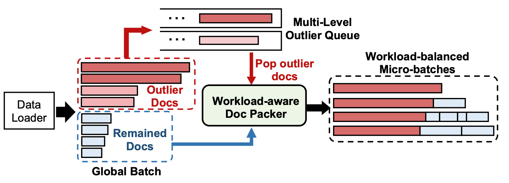

---
# Main Algorithm
Given a DP bach
- construct a document set by removing the outlier documents, filling from the queue, and rolling over any documents from the previous iteration.
- now you effectively have a set of documents that you solved for using an ILP in S3.3, however they claim that it would take too long.
- so they instead pack greedily into an array of N micro-batches. sort the documents in reverse by length, and for each document:
    - find the least loaded microbatch (first by load, next by length)
    - if it can fit this current document, great.
    - else reserve this document for a later stage.

<!-- 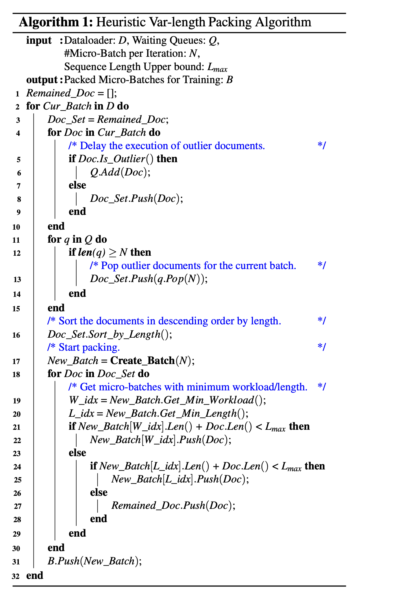 -->

---

# Improved CP sharding
**Idea**: Apply CP indexing logic to each individual document.
- This should yield a more balanced workload across multiple CP workers.
- They also implement an optimization to avoid padding tokens.

  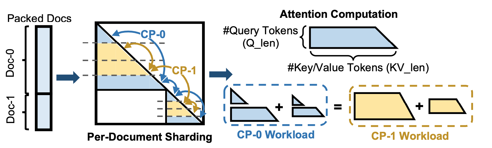

---

# Kernel inefficiencies
- Per-Document sharding achieves better balance, but it does not guarantee better performance.
- The attention kernel might become less efficient for smaller documents.
- Sharding lowers the $Q$ dimension, which might cause:
  - Longer kernel time due to redundant computations (padding $<128$ tokens)
  - Decreased throughput (unable to leverage TMA)

$$\mathrm{Attention}(Q, K, V) = \mathrm{softmax}\left(\frac{QK^\top}{\sqrt{d_k}}\right)V$$

---
# Kernel Inefficiences

  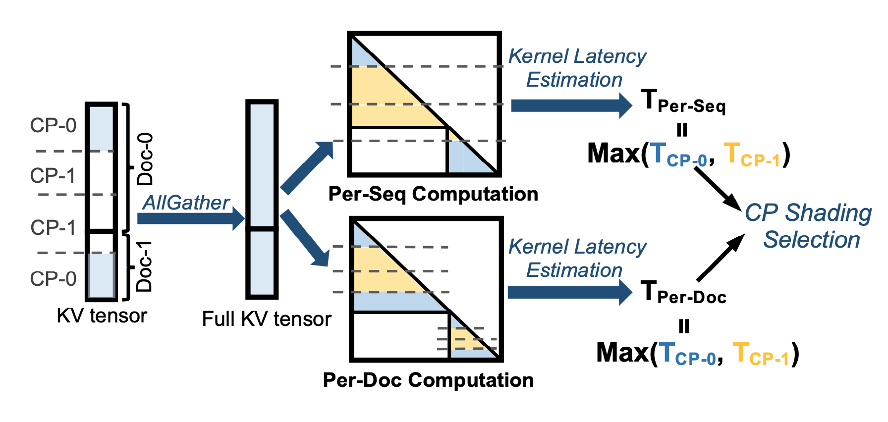

---

# Evaluation
- their contributions are in PP and CP balancing. Let's think, when would PP and CP imbalance hurt most?
    - CP: longer context, more chance of long document being assigned to imbalanced worker.
    - PP: larger model, micro-batch imbalance adds more to the latency.

---

# Speedup Breakdown
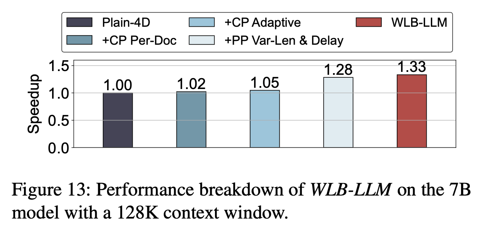

Which optimization helps us the most?

- $\texttt{PP-Var-Len}$ alone $\rightarrow$ 1.28x
- Orthogonal optimizations that combine well.
- Every second counts!

---

# Speedup across Model + Context

  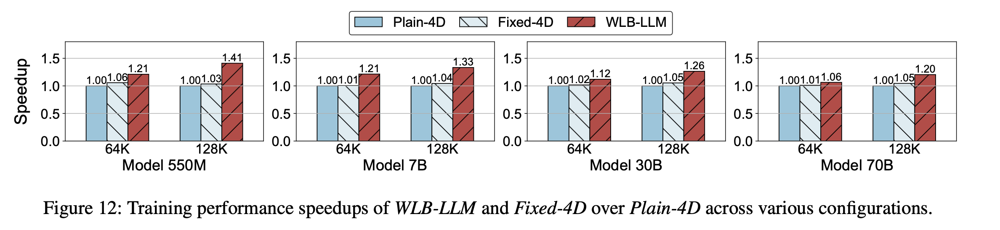

<!-- --- -->
<!-- # Evaluation: Figure 12 Notes

1. Longer context model $\rightarrow$ more speedup.
2. 
    - but, larger models see lesser improvement over baseline (why?)
        - This is because larger models involve more GPUs for training, which increases the ratio of communication latency to computation latency
        - making the impact of workload imbalance in the attention layer less significant.
    - fixed-4d does not give significant performance improvement over plain-4d.
        - however, i feel like they should have accounted for mlp in fixed-4d as well. -->

---
# Speedup vs Context Window
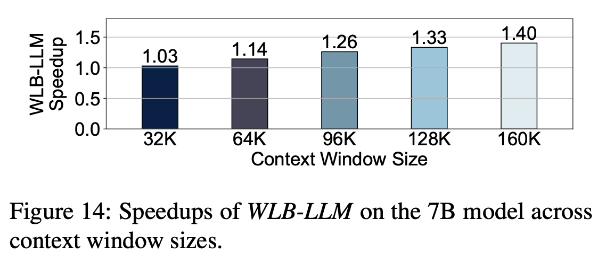

---
# Ablation - Packing Overhead

---

# Ablation - CP Sharding
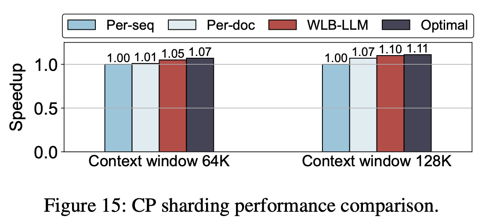

<!-- --- -->
<!-- # Evaluation: Other Results
- table 2.
    - their wlb solver achieves a low degree of imbalance, with low overhead.
    - important to note how they define imbalance.
- little performance degradation.
- figure 15.
    - speedups for different cp strategies, for constant context length.

---
# general presentation notes
- include piazza questions naturally in the flow of the presentation if highly aligned.
- include results naturally in the flow if it helps. -->
